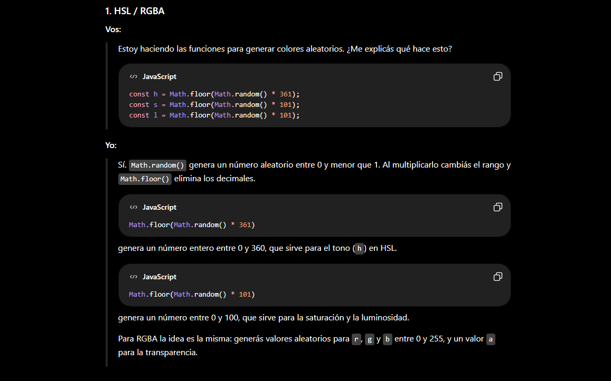
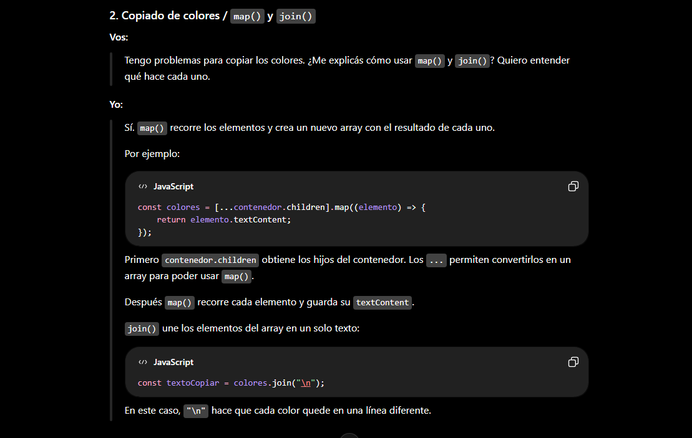
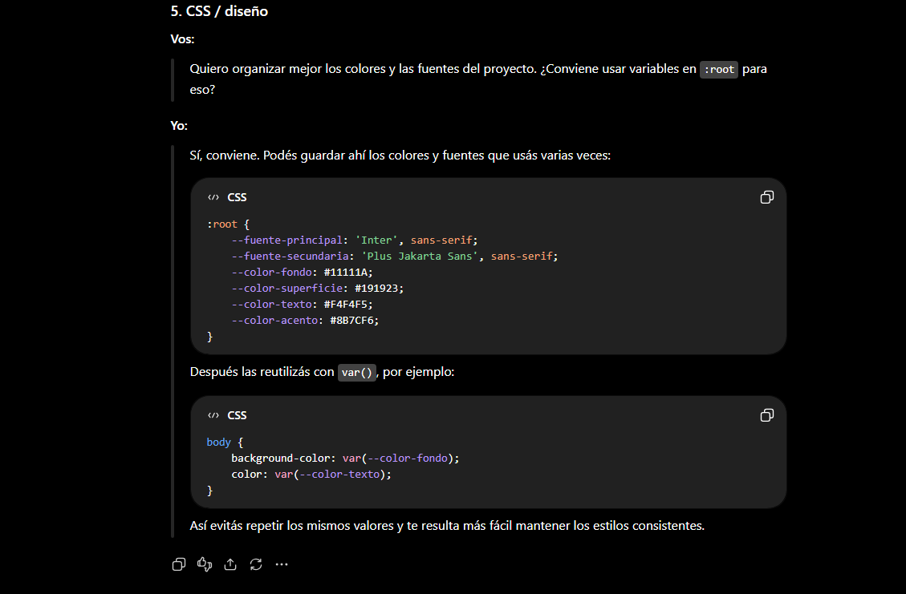
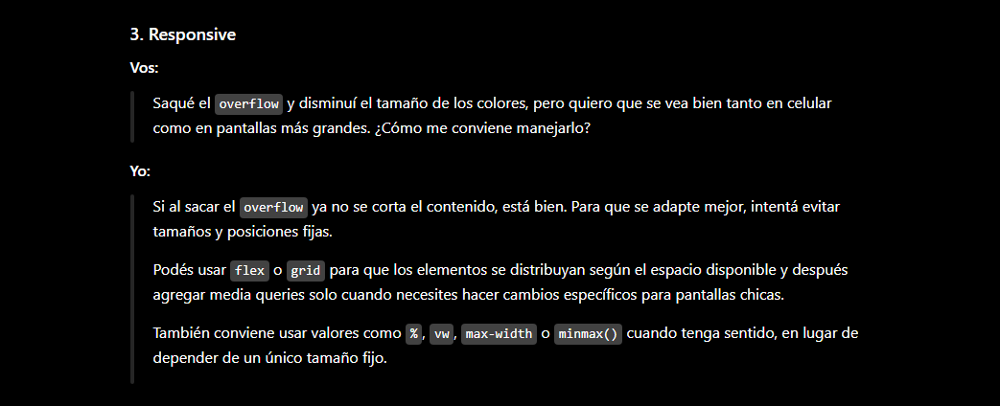
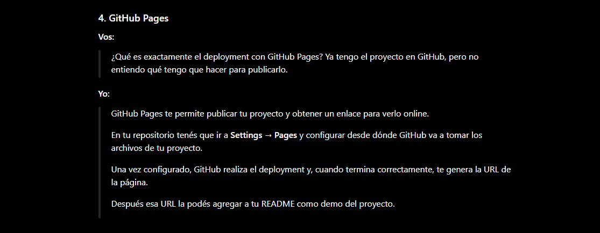

# 🤖 Uso de Inteligencia Artificial

## 1. Aprendizaje de JavaScript

Utilicé ChatGPT principalmente como herramienta de aprendizaje para comprender conceptos de JavaScript que necesitaba aplicar al proyecto.

Por ejemplo, durante el desarrollo consulté sobre:

* `Math.random()` y `Math.floor()`.
* Funciones y parámetros.
* Eventos.
* Manipulación del DOM.
* `document.createElement()`.
* `children`.
* `map()`.
* `join()`.
* `innerHTML`.
* `addEventListener()`.

La metodología utilizada fue pedir explicaciones paso a paso, probar el código y modificarlo para comprobar su funcionamiento.

**Objetivo:** comprender la lógica antes de incorporarla al proyecto.

### A continuación se incluyen algunas capturas representativas de las consultas realizadas durante el desarrollo.

---

## 2. Generación de colores

Consulté cómo estructurar la generación aleatoria de colores en formatos HSL y RGBA.

La IA ayudó a comprender los rangos de valores utilizados y la lógica necesaria para generar colores aleatorios.

A partir de estas explicaciones se implementaron las funciones:

```javascript
generarColorHSL()
generarColorRGBA()
```

Posteriormente, estas funciones fueron adaptadas y probadas dentro del proyecto.



---

## 3. Copiado de colores

Uno de los problemas encontrados durante el desarrollo fue la función encargada de copiar toda la paleta.

Consulté sobre el funcionamiento de `map()` y `join()` para comprender cómo obtener los textos de las tarjetas y convertirlos en una única cadena de texto.

Este proceso permitió entender cómo recorrer los elementos del DOM y construir el contenido que posteriormente se envía al portapapeles.

**Resultado:** se logró implementar el copiado de un color individual y de toda la paleta.



---

## 4. Diseño y CSS

También utilicé IA como apoyo para analizar decisiones visuales del proyecto.

Las consultas estuvieron relacionadas con:

* Variables CSS dentro de `:root`.
* Combinación de colores.
* Tipografías.
* Estados `hover` y `focus`.
* Animaciones.
* Diseño de los controles.
* Problemas de posicionamiento.
* Adaptación responsive.

En este caso, la IA fue utilizada principalmente para recibir sugerencias y alternativas que posteriormente fueron probadas y adaptadas al diseño del proyecto.





---

## 5. Git, GitHub y GitHub Pages

Utilicé ChatGPT para comprender el flujo básico de trabajo con Git y GitHub, especialmente porque era uno de los primeros proyectos en los que estaba utilizando control de versiones de forma organizada.

Las consultas estuvieron relacionadas con:

* Commits.
* Ramas.
* Subida del proyecto a GitHub.
* GitHub Pages.
* Errores durante el deployment.
* Revisión del estado del proyecto.

Esto permitió mantener un historial de cambios y desplegar una versión funcional del proyecto.



---

## 6. Documentación

Finalmente, utilicé IA como apoyo para organizar la documentación del proyecto.

Se consultó sobre:

* Estructura del README.
* Decisiones técnicas.
* Organización de carpetas.
* Capturas y GIF del funcionamiento.
* Cómo documentar correctamente el uso de IA.

La información fue revisada y adaptada para representar el proceso real de desarrollo.

---

## 📌 Conclusión

La Inteligencia Artificial fue utilizada como **herramienta de apoyo, aprendizaje y resolución de problemas**, principalmente para comprender conceptos que todavía estaba aprendiendo y para recibir orientación cuando aparecían errores o dificultades.

El desarrollo del proyecto se realizó de forma progresiva: se consultaban conceptos o problemas específicos, se analizaba la explicación, se implementaba la solución y se realizaban pruebas para comprobar su funcionamiento.
